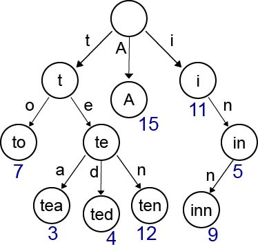
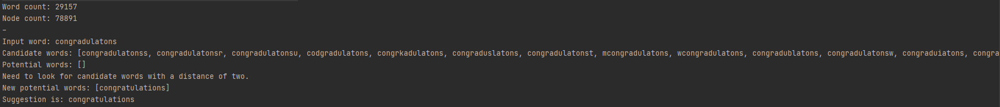

# Spelling Corrector

This program suggests possible corrections for a misspelled word.

The main highlight of this project is the use of a handbuilt [trie (data structure)](https://en.wikipedia.org/wiki/Trie) to store the possible words.
This data structure store letters as nodes, where words can be built up through a DFS.  Additionally, words in the graph are given a value weight.

For example:



*"A trie for keys "A", "to", "tea", "ted", "ten", "i", "in", and "inn". Each complete English word has an arbitrary integer value associated with it."*

## The Algorithm

The algorithm takes in a give word and tries to find a matching word that appears in our word bank.
This is achieved by editing the given word and checking for matches.

Edits can happen in four diferent ways, each with a different distance:
- **Deletion Distance**: A string s has a deletion distance 1 from another string t if and only if t
is equal to s with one character removed. The only strings that are a deletion distance of
1 from “bird” are “ird”, “brd”, “bid”, and “bir”. Note that if a string s has a deletion distance
of 1 from another string t then |s| = |t| -1. Also, there are exactly | t | strings that are a
deletion distance of 1 from t . The dictionary may contain 0 to n of the strings one deletion
distance from t .
- **Transposition Distance**: A string s has a transposition distance 1 from another string t if
and only if t is equal to s with two adjacent characters transposed. The only strings that
are a transposition Distance of 1 from “house” are “ohuse”, “huose”, “hosue” and
“houes”. Note that if a string s has a transposition distance of 1 from another string t then
|s| = |t|. Also, there are exactly | t | - 1 strings that are a transposition distance of 1 from t .
The dictionary may contain 0 to n of the strings one transposition distance from t .
- **Alteration Distance**: A string s has an alteration distance 1 from another string t if and
only if t is equal to s with exactly one character in s replaced by a lowercase letter that is
not equal to the original letter. The only strings that are a alternation distance of 1 from
“top” are “aop”, “bop”, …, “zop”, “tap”, “tbp”, …, “tzp”, “toa”, “tob”, …, and “toz”. Note that
if a string s has an alteration distance of 1 from another string t then |s| = |t|. Also, there
are exactly 25* | t | strings that are an alteration distance of 1 from t . The dictionary may
contain 0 to n of the strings one alteration distance from t .
- **Insertion Distance**: A string s has an insertion distance 1 from another string t if and only
if t has a deletion distance of 1 from s . The only strings that are an insertion distance of 1
from “ask” are “aask”, “bask”, “cask”, … “zask”, “aask”, “absk”, “acsk”, … “azsk”, “asak”,
“asbk”, “asck”, … “aszk”, “aska”, “askb”, “askc”, … “askz”. Note that if a string s has an
insertion distance of 1 from another string t then |s| = |t|+1. Also, there are exactly 26* (| t |
+ 1) strings that are an insertion distance of 1 from t . The dictionary may contain 0 to n of
the strings one insertion distance from t .

For this project, we try for a distance of 1 first, and then increase it to 2 if no match is found.

To review the implementation, see [SpellCorrector.java](src/spell/SpellCorrector.java).

## Running the Program

```java spell.Main *bank* *word*```

#### Example
```java spell.Main notsobig.txt congradulatons```


